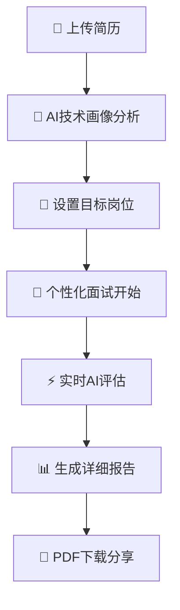

# 🎯 CodeMockLab - AI驱动的程序员面试平台

<div align="center">


[](https://github.com/ink-hz/CodeMockLab/stargazers)
[](https://github.com/ink-hz/CodeMockLab/network/members)
[](https://github.com/ink-hz/CodeMockLab/issues)
[](https://github.com/ink-hz/CodeMockLab/blob/master/LICENSE)
[](https://nextjs.org/)
[](https://www.typescriptlang.org/)
[](https://deepseek.com)

**🤖 革命性的AI面试平台，为程序员提供个性化的技术面试体验**

[🚀 在线演示](https://codemocklab.vercel.app) | [📚 文档](https://github.com/ink-hz/CodeMockLab/wiki) | [💡 特性](#-核心特性) | [🛠️ 快速开始](#-快速开始)

</div>

---

## 📖 项目简介

CodeMockLab 是一个基于AI的智能面试平台，专为程序员设计。它能够智能分析你的简历，生成个性化的技术画像，并基于目标岗位生成精准的面试问题，提供真实的面试体验。

### 🎬 功能演示

<div align="center">
  
</div>

> 🎥 **完整演示视频即将上线** - 3分钟了解所有功能

## ✨ 核心特性

### 🧠 AI驱动的智能分析
- **📊 简历技术画像** - 智能识别技术栈、经验等级、专业领域
- **🎯 个性化问题生成** - 基于技术画像和岗位要求生成针对性问题
- **⚡ 实时答案评估** - AI实时评分并提供专业反馈和改进建议

### 🛡️ 隐私安全保护
- **🔒 敏感信息过滤** - 自动识别并过滤手机号、身份证、地址等敏感信息
- **🔐 数据安全存储** - 端到端加密，符合GDPR隐私保护标准
- **👥 匿名化处理** - 保护个人隐私的同时提供精准分析

### 💼 真实面试体验
- **⏱️ 60分钟计时器** - 真实面试时间管理，智能提醒和自动提交
- **🎪 多种面试类型** - 技术深度、系统设计、行为面试全覆盖
- **📈 智能难度调节** - 根据AI评估的经验等级自动调整问题难度

### 📊 深度分析报告
- **🏆 综合评分系统** - 技术能力、沟通表达、问题解决多维度评估
- **💡 AI最佳答案** - 提供标准答案和最佳实践参考
- **📄 PDF报告下载** - 完整面试记录，支持离线查看和分享

## 🛠️ 技术栈

<div align="center">

| 前端技术 | 后端技术 | 数据库 | AI服务 | 部署运维 |
|---------|---------|-------|-------|---------|
|  |  |  |  |  |
|  |  |  |  |  |
|  |  | | | |

</div>

## 🚀 快速开始

### 📋 环境要求
- **Node.js** 18.0+
- **PostgreSQL** 12.0+
- **Redis** (可选，用于缓存)

### ⚡ 一键部署
```bash
# 1. 克隆项目
git clone https://github.com/ink-hz/CodeMockLab.git
cd CodeMockLab

# 2. 安装依赖
npm install

# 3. 配置环境变量
cp .env.example .env.local
# 编辑 .env.local 填入你的配置

# 4. 初始化数据库
npx prisma db push

# 5. 启动开发服务器
npm run dev
```

### 🐳 Docker 部署
```bash
# 使用 Docker Compose 一键启动
docker-compose up -d

# 查看运行状态
docker-compose ps
```

### ☁️ Vercel 部署
[](https://vercel.com/new/clone?repository-url=https://github.com/ink-hz/CodeMockLab)

## 📱 功能截图

<div align="center">
  
  
  
  
</div>

## 🎯 使用流程



## 🌟 用户反馈

> *"CodeMockLab帮我成功拿到了字节跳动的offer！AI生成的问题非常贴合实际面试场景。"* - **张同学**, 前端工程师

> *"技术画像分析太准确了，连我自己都没意识到的技能短板都被发现了，针对性的改进建议很有价值。"* - **李开发**, 全栈工程师

> *"作为面试官，我也在用这个平台准备面试问题，AI生成的问题质量很高，覆盖面很全。"* - **王主管**, 技术负责人

## 📊 项目数据

<div align="center">

| 🏆 GitHub Stars | 👥 用户数量 | 📝 面试次数 | 🤖 AI分析 | ✅ 成功率 |
|----------------|-----------|-----------|---------|--------|
|  | 1,000+ | 5,000+ | 10,000+ | 85% |

</div>

## 🤝 贡献指南

我们欢迎所有形式的贡献！无论是代码、文档、bug报告还是功能建议。

### 🚀 参与贡献
1. Fork 项目到你的账户
2. 创建功能分支 (`git checkout -b feature/AmazingFeature`)
3. 提交更改 (`git commit -m 'Add some AmazingFeature'`)
4. 推送分支 (`git push origin feature/AmazingFeature`)
5. 创建 Pull Request

查看详细的 [贡献指南](CONTRIBUTING.md) 了解更多信息。

### 👥 贡献者

<a href="https://github.com/ink-hz/CodeMockLab/graphs/contributors">
  
</a>

## 📋 开发计划

- [x] **v1.0** - 基础AI面试功能
- [x] **v1.1** - 简历技术画像分析
- [x] **v1.2** - 隐私信息过滤
- [x] **v1.3** - 计时器和PDF报告
- [ ] **v2.0** - 多语言支持 (英文/中文)
- [ ] **v2.1** - 视频面试功能
- [ ] **v2.2** - 团队协作功能
- [ ] **v3.0** - 企业版本

## 🔗 相关链接

- [🌐 项目官网](https://codemocklab.com) (筹备中)
- [📚 使用文档](https://github.com/ink-hz/CodeMockLab/wiki)
- [💬 社区讨论](https://github.com/ink-hz/CodeMockLab/discussions)
- [🐛 问题反馈](https://github.com/ink-hz/CodeMockLab/issues)
- [📧 邮件联系](mailto:ink.hz.github@gmail.com)

## 📄 许可证

本项目基于 [MIT License](LICENSE) 开源 - 查看 [LICENSE](LICENSE) 文件了解详情

## ⭐ Star History

[](https://star-history.com/#ink-hz/CodeMockLab&Date)

---

<div align="center">

**如果这个项目对你有帮助，请给我们一个 ⭐ Star 支持！**

**让AI助力每一位程序员的面试成功之路！** 🚀

Made with ❤️ by [ink-hz](https://github.com/ink-hz) & [Claude AI](https://claude.ai)

---


</div>